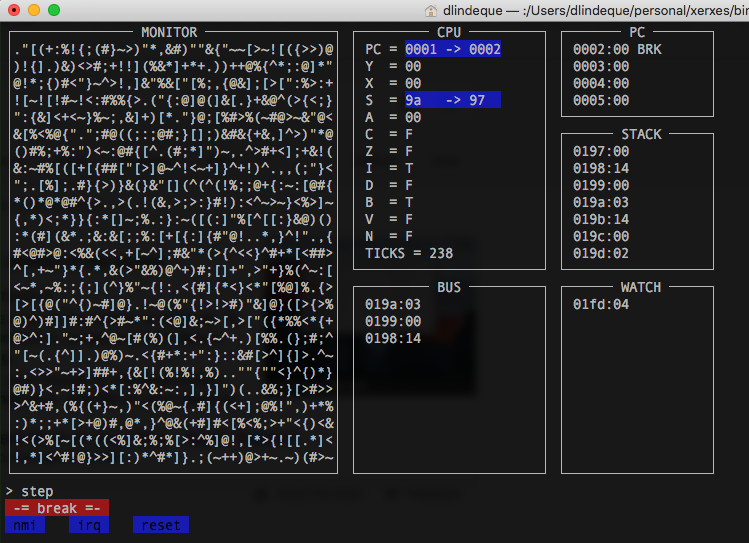

# Project XERXES
The idea of this project is to <i>build</i> a computer from scratch, albeit a virtual one. The current plan is as follows:
* Phase 1
  * Create the virtual hardware
    * [x] CPU
    * [x] System Bus
    * [x] RAM
    * [x] Machine with a system clock
    * [x] Punch card reader
    * [x] Monitor
    * [ ] Keyboard
    * [x] ROM
    * [ ] HDD
  * Create an Operating System
    * Encode a few system functions using punch cards
      * [ ] Punch card reader driver
      * [ ] Monitor driver
      * [ ] Keyboard driver
      * [ ] HDD driver
    * [ ] Encode a text editor using punch cards
    * [ ] Encode an assembler using punch cards
    * [ ] Encode a compiler using assembly
    * [ ] Encode an operating system using the compiler

## Virtual CPU
Base the CPU on the 6502.

## Virtual System Bus
CPU's and Devices connect to the system bus only. CPU's and devices all read and write to addresses on the system bus.

## Virtual machine
The virtual machine will host a system bus, a set of CPU's and collection of other devices. It will also run a clock to clock the system.

## Virtual punch card reader
A punch card will be represented by a text file on the host computer, and the reader will read this file as if it is a punch card. The punch card reader is a serial device. Once the punch card reader starts, the reader will use IRQ's to signal when the next instruction is ready. When that
happens, the CPU will read the instruction from the punch card reader's <i>status</i> address. Each byte represented by the punch card will be one line in the file. Each line will have <i>holes</i> representing the information of the line. A <i>hole</i> will be represented by <i>O</i>, and a <i>non-hole</i> is <i>_</i>. A hole is a <i>set</i> bit. The line will start with two bits indicating the instruction of the line. The line instructions are as follows:  
| holes | Meaning
|--- |---
| _ O | line contains data
| O _ | lo of new address to write to
| O O | hi of new address to write to
````
O _  _ _ _ _  _ _ _ _ ; 0x00 (address lo)
O O  _ _ _ _  _ _ O _ ; 0x02 (address hi)
_ O  _ O _ _  O _ O O ; 0x4B (data)
_ O  _ _ O _  _ _ _ _ ; 0x20 (data)
````
All whitespace (except line ends) are ignored. We have line comments starting with ```;```, representing written notes on the cards. The <i>I/O</i> settings for the device will be as follows:
| Address | Direction | Purpose
| --- |--- |---
| 0xD02F | Write | Control
| 0xD030 | Read | Status
| 0xD031 | Read | Register
The operation is as follows:
1. Write a control byte (0xD02F)
   * 01: Initialize
   * 02: Run / continue
2. Wait on IRQ for response. Read 0xD030
   * 00: Not this device
   * 01: Register contains data
   * 02: Register contains address lo byte
   * 03: Register contains address hi byte
   * 04: No more instructions (done)
3. The register data can be read from 0xD031.
### Punch Card compiler
We <i>employ</i> an intern to help with the process of creating punchcards. The <i>professional</i> would write text in terms of <i>opcodes</i> and <i>labels</i> then the intern would translate it to punchcards. This is done using a program to represent the intern.
## ROM
The first ROM will be the ROM required for the last page of the system which holds
the vectors for IRQ, RESET and NMI. The initial program written to ROM will be
to achieve the following
* Configure the vectors (IRQ, RESET, NMI)
* Initialize the system
  * Set Stack Pointer to FF
  * Run driver initialization routines (only punch card reader at first)
* Loop while processing IRQ's from punch card reader
* The IRQ of the punch card reader will be for
  * Read next byte
  * Start program

## Text editor
The text editor is the simplest editor. All that is needed is to be able to add, change and delete characters in a file. Almost like the simplest version of vi. The text editor edits text in a specific location in RAM.

## Assembler
The first version of the assembler is the simplest assembler, to read a file of assembly instructions and encode them to binary code. The source text will be read from a specific hard coded address (where the text editor operate), and written to a specific hard coded address.
````asm
LDA #$01
STA $0200
LDA #$05
STA $0201
LDA #$08
STA $0202
````

## Compiler
The first compiler will be a non-optimizing compiler. We will have a lexer, parser and code generator. The language will be C-like and will include the <i>asm</i> syntax for raw assembly code.

## Operating system
The operating system is basically just a terminal window. It includes an 'nix kind of file system.

## Emulator

